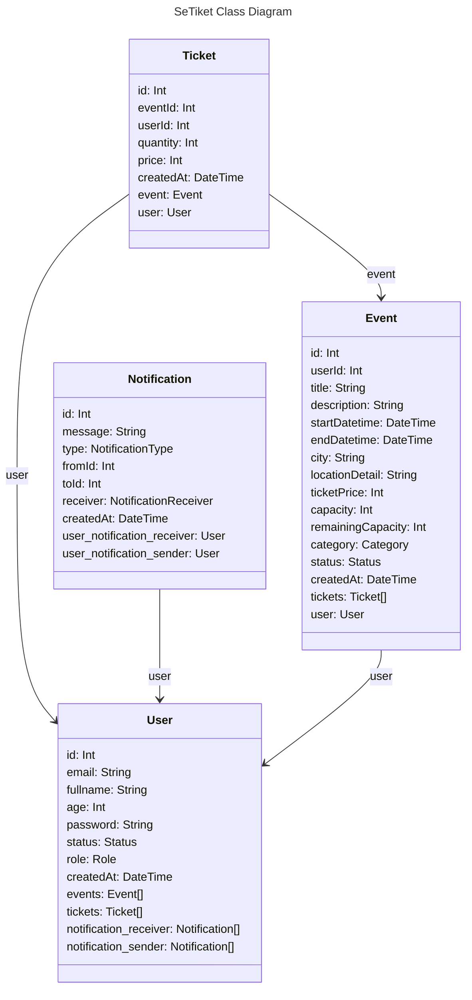

```mermaid
---
title: SeTiket Class Diagram
---
classDiagram
  class Ticket {
    id: Int
    eventId: Int
    userId: Int
    quantity: Int
    price: Int
    createdAt: DateTime
    event: Event
    user: User
  }

  class User {
    id: Int
    email: String
    fullname: String
    age: Int
    password: String
    status: Status
    role: Role
    createdAt: DateTime
    events: Event[]
    tickets: Ticket[]
    notification_receiver: Notification[]
    notification_sender: Notification[]
  }

  class Notification {
    id: Int
    message: String
    type: NotificationType
    fromId: Int
    toId: Int
    receiver: NotificationReceiver
    createdAt: DateTime
    user_notification_receiver: User
    user_notification_sender: User
  }

  class Event {
    id: Int
    userId: Int
    title: String
    description: String
    startDatetime: DateTime
    endDatetime: DateTime
    city: String
    locationDetail: String
    ticketPrice: Int
    capacity: Int
    remainingCapacity: Int
    category: Category
    status: Status
    createdAt: DateTime
    tickets: Ticket[]
    user: User
  }

  Ticket --> User : user
  Ticket --> Event : event
  Notification --> User : user
  Event --> User : user

```
