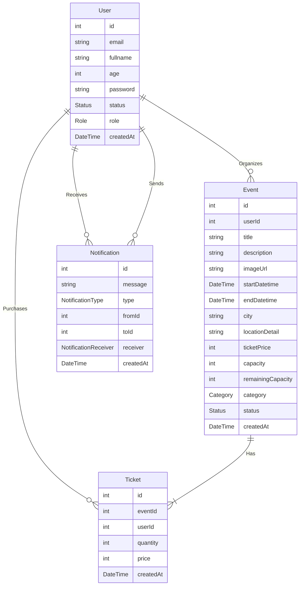

```mermaid
erDiagram
  User ||--o{ Event : "Organizes"
  User ||--o{ Ticket : "Purchases"
  User ||--o{ Notification : "Receives"

  Event ||--|{ Ticket : "Has"
  User ||--o{ Notification : "Sends"

  Event {
    int id
    int userId
    string title
    string description
    string imageUrl
    DateTime startDatetime
    DateTime endDatetime
    string city
    string locationDetail
    int ticketPrice
    int capacity
    int remainingCapacity
    Category category
    Status status
    DateTime createdAt
  }

  Ticket {
    int id
    int eventId
    int userId
    int quantity
    int price
    DateTime createdAt
  }

  User {
    int id
    string email
    string fullname
    int age
    string password
    Status status
    Role role
    DateTime createdAt
  }

  Notification {
    int id
    string message
    NotificationType type
    int fromId
    int toId
    NotificationReceiver receiver
    DateTime createdAt
  }

```
